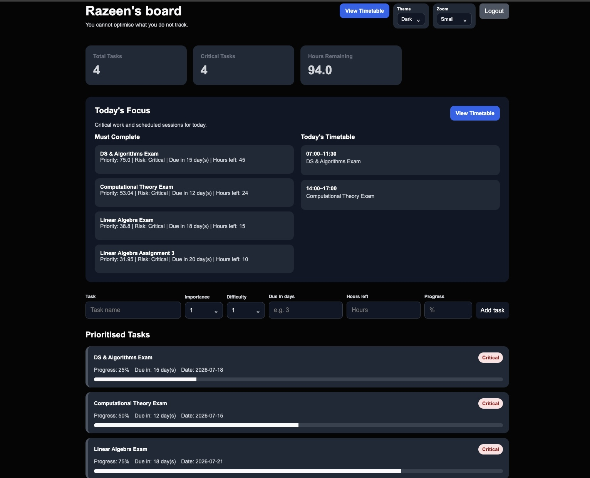
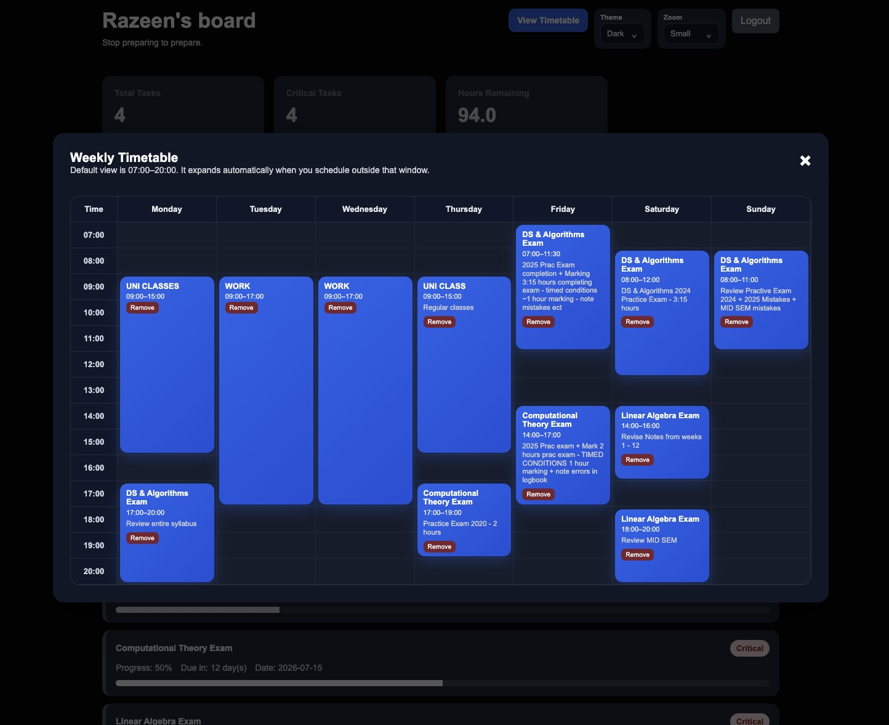
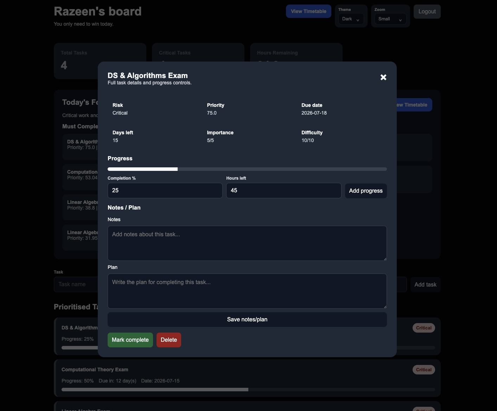
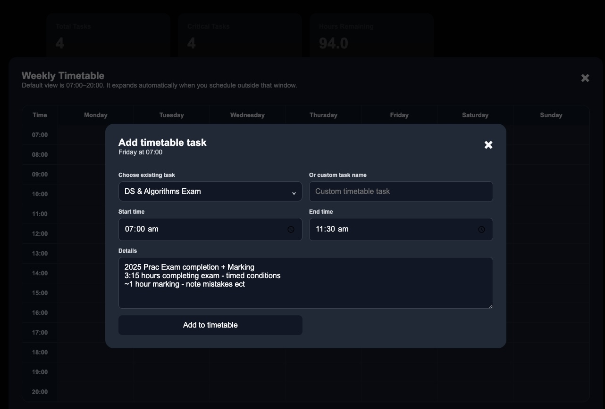

# DynamicBoard

**Live site:** [dynamicboard-o9o4.onrender.com](https://dynamicboard-o9o4.onrender.com)


DynamicBoard is a Flask-based productivity dashboard that helps users manage tasks, prioritise urgent work, and convert deadlines into a structured weekly timetable.

The app combines task tracking, priority scoring, Google authentication, and a visual weekly planner into one focused workspace.

## Features

- Google sign-in with OAuth
- Personal task storage per Google account
- Smart task priority scoring
- Risk labels for urgent tasks
- Today's Focus section for critical work
- Weekly timetable planner
- Add timetable sessions from existing tasks or custom tasks
- Task progress tracking
- Notes and planning section for each task
- Dark themed responsive interface

## Screenshots

### Dashboard



### Weekly Timetable



### Task Details Modal



### Add Timetable Task



## Tech Stack

- Python
- Flask
- Jinja2
- HTML
- CSS
- JSON file storage
- Google OAuth
- Authlib
- python-dotenv

## Project Structure

```text
DynamicBoard/
  app.py
  constants.py
  data_store.py
  task_logic.py
  routes.py
  tasks.json
  .env
  .env.example
  .gitignore
  README.md

  templates/
    index.html
    login.html
    dashboard.html
    modals.html

  static/
    style.css

  screenshots/
    Dashboard.jpeg
    TaskModa.jpeg
    Timetable.jpeg
    TimetableTask.jpeg